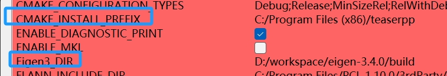

# WIN-TEASER++
The original repository code running platform is linux，this repository is the unofficial windows version of teaser++,only the C++ version was tested.
official version :https://github.com/MIT-SPARK/TEASER-plusplus
## Compared to the previous repository, added some header files under windows in win directory:
+ win
  + dirent.h
  + getopt.c
  + getopt.h
  + unistd.h
  + win_time.h

## Environment
+ PCL1.10
+ CMAKE 3.2.0
+ Eigen 3.4 (https://eigen.tuxfamily.org/index.php?title=Main_Page)
+ Visual stdio 2019

## 1.Installation
I use cmake-gui to generate the project,but there was an error during the first configure, so I downloaded this part of the code ahead of time and put it in the build directory.

<font color="red">
CMake Error at CMakeLists.txt:98 (add subdirectory):add subdirectory given source "D:/workspace/TEASER-plusplus-master/build1/pmc-src " which is not an existing directory.

CMake Error at CMakeLists.txt:107(add subdirectory):add subdirectory given source "D:/workspace/TEASER-plusplus-master/build1/tinyply-src" which is not an existing directory.

CMake Error at CMakeLists.txt:109 (target include directories):Cannot specify include directories for target "tinyply" which is not built by this project.
</font>

+ source
  + googletest-src
  + pmc-src
  + pybind11-src
  + spectra-src
  + tinyply-src


- build steps:
  + opencv cmake-gui 
  + select source code path 
  + select where build path 
  + configure 
  + select CMAKE_INSTALL_PREFIX(As illustrated in following figure
)
  + select Eigen3_DIR(As illustrated in following figure)
  + configure
  + generate
 




## 2.Visual stdio Generate dll

- open project ->build->INSTALL

Install directory: C:/Program Files (x86)/teaserpp (If you change it, it's your own address)
+ Install directory/teaserpp:
```
├─bin
│      tinyply.dll
│      tinyplyd.dll
│
├─include
│  │  tinyply.h
│  ├─include
│  ├─pmc
│  └─teaser
│         
└─lib
```


## 3.Test
In order to facilitate the reading of data, I modified the code and used PCL to read the point cloud

- code path:
./example/teaser_cpp_fpfh/teaser_cpp_fpfh.cc

- cmake-gui->configure->generate->open_project->build

- copy_file pmc.dll teaser_features.dll teaser_io.dll teaser_registration.dll to example\teaser_cpp_fpfh\build\Release

- results:
```=====================================
          TEASER++ Results
=====================================
Estimated rotation:
  0.996344  0.0743931   0.042007
-0.0738955   0.997178 -0.0132802
-0.0428764  0.0101275   0.999029

Estimated translation:
-137.943
 30.9094
-33.1828

Time taken (s): 0.010525

```
